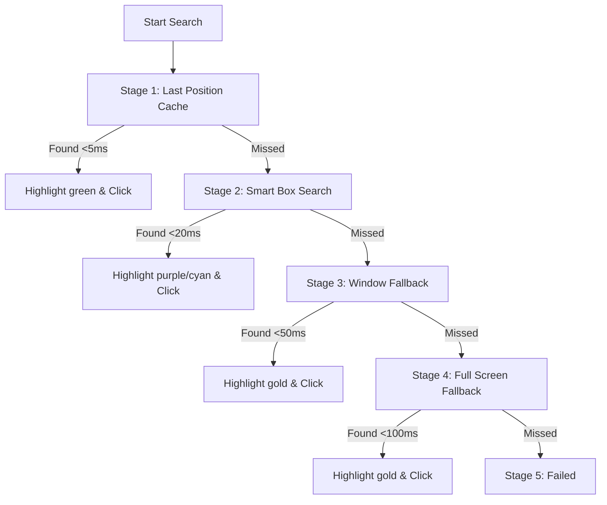

# Image Search Cascade and Smart Box Preview Behavior

This document outlines the behavior, flow, and visual overlay rules of the dynamic Image Search Cascade and the temporary debugging helper highlights.

---

## 1. The Image Search Cascade (Flow)
When an image search is executed, the engine runs through a multi-stage fallback cascade. This ensures the search is as fast as possible in normal situations, but remains highly reliable if layouts change:

1. **Stage 1: Last Position Cache (Instant):** If the image was previously found at the same coordinates twice, the engine searches a tiny $8\text{px}$ boundary around that spot first. This takes `<5ms` and completely bypasses window and screen scanning.
2. **Stage 2: Smart Box Search (Local Window Rebase):** If cache misses, the engine finds the target window and searches inside a small bounding box centered where the image was originally captured. This follows the window if it moves and takes `<20ms`.
3. **Stage 3: Window Fallback (Resizing Recovery):** If the window was resized, the image shifts relative to the window origin and falls outside the Smart Box. The engine then scans the **entire target window** to find it.
4. **Stage 4: Full Screen Fallback (Last Resort):** Scans the entire screen. If there are multiple target windows open (e.g., Instance A and Instance B), it will match the top-left-most instance first.

---

## 2. Dynamic Smart Box Rebase & Window Candidate Selection
* **Behavior:** The Smart Box is not static. When captured with standard mode, it saves `SourceWindowX` and `SourceWindowY`.
* **Rebasing:** At search time, it queries the target window's current position (`_SmartBaseX`, `_SmartBaseY`) and adds the relative offsets to draw the search area. This means you can drag the window anywhere, and the Smart Box follows it.
* **Candidate Window Selection Priority:** When multiple windows/instances of the target process exist, Stage 2 (Smart Box) and Stage 3 (Window Fallback) search candidate windows in a strict order:
  1. **Recorded Target Window**: `WinExist(SearchImageSourceWindowTitle . " ahk_exe " . AppName)`
  2. **Active Window**: `WinActive("ahk_exe " . AppName)`
  3. **Other Process Windows**: Iterates remaining process windows returned by `WinGetList`, skipping any minimized windows (`WinGetMinMax == -1` or `X < -10000`).
  *This ensures that scrolling within the captured window priority-searches that window across its full bounds instead of picking a random duplicate background window.*
* **Simple Capture Mode Hybrid:** When "Simple Capture" is ON, it skips Image Studio and auto-scoping (saving scope as "Full Screen"). However, it still saves the window process identity (`SearchImageSourceAppName` + window handle coordinates). This ensures that if the window moves, the **Window Fallback** stage can still find it inside the moved window rather than searching the whole screen blindly.

---

## 3. Visual Debug Highlight Rules (Preview Mode)
During preview, the following colors represent the search results and boundaries:

| Color | Meaning | Condition |
| :--- | :--- | :--- |
| **Purple (`9D00FF`)** | Exact Match | Drawn around the final coordinates where the image was found. |
| **Cyan (`00FFFF`)** | Smart Box Bounding Box | Drawn around the search area. **Only shown when the window moves (rebased Smart Box search)** to help visually verify the tracking. |
| **Green (`00C800`)** | Cache Hit | Highlights the match when found via the Last Position Cache. |
| **Gold (`FFD700`)** | Fallback Match | Highlights the match when found via Window or Full Screen fallbacks. |
