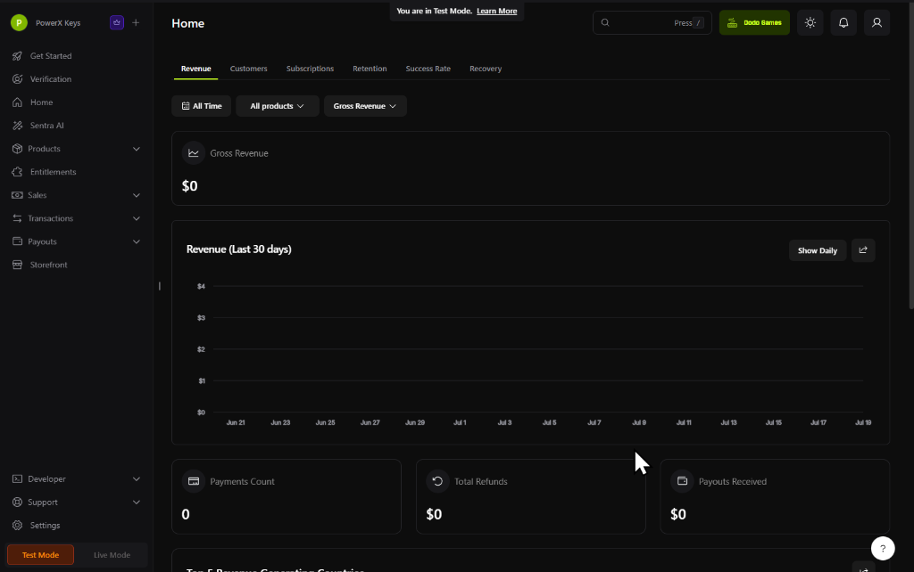

# 🎨 Design & Style References

Here are the design references and links to consider for future UI/UX styling (e.g., for **V3 WebView2 Rebuild**).

## 🔗 Website References
* [EmailOSINT](https://emailosint.org/) — Clean structure for OSINT tooling/documentation.
* [Dodo Payments](https://dodopayments.com/) — Sleek dark payment-focused dashboard and landing page styling.
* [OSINT.ly](https://osint.ly/) — Modern, clean design for OSINT lookup tools.
* [Untitled UI Icons](https://www.untitledui.com/components/icons) — 4,600+ clean neutral SVG icons and React/Figma component design system for V3 UI.

## 📊 V3 Dashboard / App Layout Reference
The user likes this style and structure for a potential future interface (such as a V3 version of the app). 

### Layout & Style Breakdown:
* **Sidebar Navigation**: Sleek, dark sidebar on the left with clean icons and clear groupings (Get Started, Verification, Sentra AI, Products, Sales, Developer, Settings). Contains a "Test Mode / Live Mode" toggle at the bottom.
* **Top Header**: Simple, containing the active page title ("Home"), a search bar shortcut (`Press /`), user/organization workspace selector ("Dodo Games"), light/dark theme switch, notifications, and profile.
* **Horizontal Navigation Tabs**: Quick tabs directly under the header (e.g., Revenue, Customers, Subscriptions, Retention, Success Rate, Recovery).
* **Metric Cards & Charts**: Cards for main KPIs (Gross Revenue, Payments Count, Payouts) with large text, plus interactive graphical visualizations (Revenue over time chart) utilizing clean dark-themed backgrounds.
* **Style Guidelines**: Replicate the clean structure and modern layout styling while preserving our own core branding/color themes.

### Reference Screenshot:

