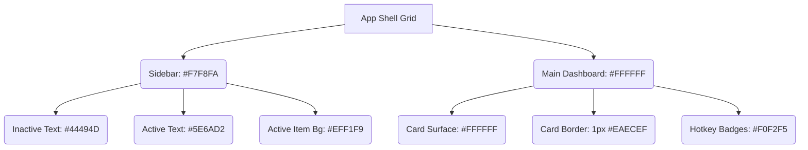

# Professional Brand Light Mode Design Systems

This document collects design research and precise color tokens from professional applications (Linear, Notion, Slack, Figma) to design a premium, state-of-the-art Light Mode for PowerX Keys.

---

## 1. Linear (Clean & Modern Developer UI)
Linear is famous for its clean, premium developer UI. It uses a **"Soft Contrast"** design to prevent eye strain.

### Design Tokens (Ash Theme)
*   **App Background:** `#FFFFFF` (pure white for main content areas)
*   **Sidebar Background:** `#F7F8FA` (a very subtle grey-blue to establish visual separation)
*   **Card Background:** `#FFFFFF` with a crisp, thin border
*   **Borders & Separators:** `#EAECEF` or `#EDEEF3` (translucent light gray, extremely thin, 1px)
*   **Primary Text (Body):** `#3A3F42` or `#44494D` (never pitch black `#000000`; uses soft slate-charcoal)
*   **Muted Text:** `#8A8F98` (for subtitles and secondary info)
*   **Brand Accent:** `#5E6AD2` (deep indigo for buttons and active selections)
*   **Active Item Highlight:** `#EFF1F9` or `#0A5E6AD2` (light blue-purple wash background with a vertical accent bar)

---

## 2. Notion (Minimalist & Aesthetic Workspace)
Notion relies on high legibility, thin borders, and structured whites.

### Design Tokens
*   **App/Page Background:** `#FFFFFF`
*   **Sidebar/Callout Background:** `#F1F1EF` (warm, soft grey)
*   **Text (Primary):** `#37352F` (very soft, warm charcoal-black)
*   **Text (Muted):** `#787774`
*   **Borders:** `#E3E2E0` (very light grey)
*   **Selectable Highlights:** `#E3E2E0` (hover), `#F1F1EF` (active list selection)

---

## 3. Slack (Vibrant & Cozy Team Interface)
Slack uses cozy colors, rounded buttons, and accessible contrast.

### Design Tokens (Default Light)
*   **App Background:** `#FFFFFF`
*   **Sidebar Background:** `#F4F5F7` or `#EAECEF`
*   **Active Tab Background:** `#1264A3` (brand blue) or `#EFF1F6` (light active wash)
*   **Primary Text:** `#1D1C1D` (soft dark charcoal)
*   **Secondary Text:** `#616061`
*   **Borders:** `#DDDDDD`

---

## 4. Figma (Professional Creative Tool)
Figma uses an ultra-precise, structural layout.

### Design Tokens
*   **Canvas Background:** `#F5F5F5`
*   **Sidebar Panels Background:** `#FFFFFF`
*   **Primary Text:** `#333333`
*   **Borders:** `#E6E6E6`
*   **Active Focus/Selections:** `#0C8CE9` (Figma Blue)

---

## 5. Architectural Guide for PowerX Keys Light Mode

To make PowerX Keys feel extremely premium in Light Mode, we will adopt the **Linear-Ash** and **Figma** guidelines:

### Action Items for PowerX Keys
1.  **Stop using pitch black (`#000000`) and pure white (`#FFFFFF`) for text interaction.**
    *   Change active settings sidebar text and labels to `#5E6AD2` (Brand Accent Indigo) or `#1E202B` (Charcoal).
2.  **Soften the Sidebar.**
    *   Apply sidebar background `#F7F8FA` and active wash `#EFF1F9` so it is not a solid plain gray block.
3.  **Refine Card Elevation.**
    *   Set cards to pure white (`#FFFFFF`), cards border to `#EAECEF` and add a very soft drop shadow (`#0C000000` blur radius 4).
