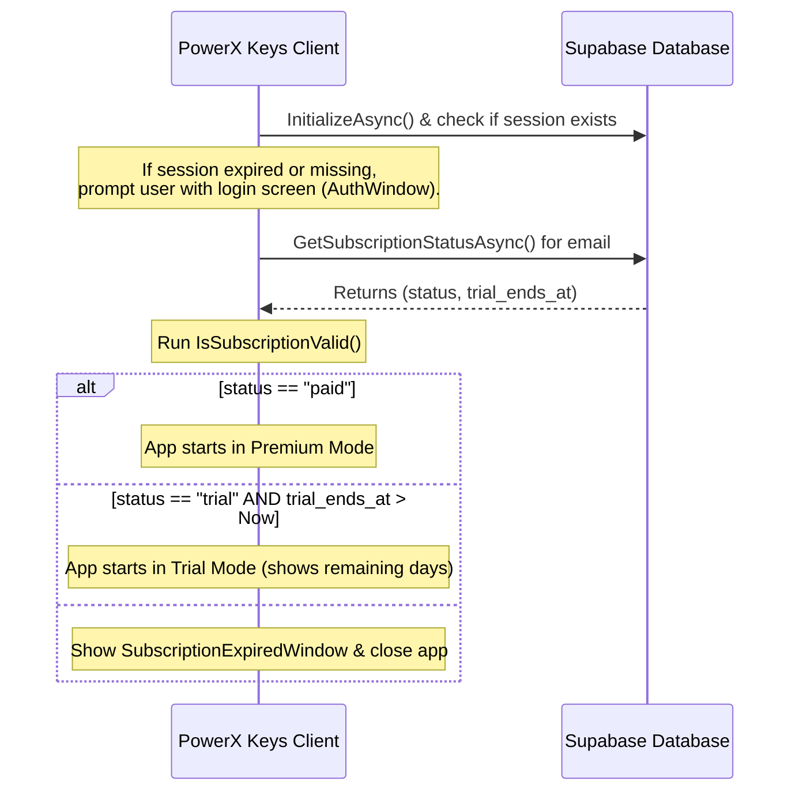

# Payment & Authentication System Architecture

This document maps out the end-to-end integration between **Supabase Auth**, the **Supabase billing flow**, and the **PowerX Keys** desktop client.

> ⚠️ **Note (2026-08-01):** **Dodo Payments is NOT implemented in the codebase.** There is no Dodo SDK, webhook handler, or checkout integration anywhere in the code. Payments/subscriptions run **entirely through Supabase** (`PowerX.Services/Services/SupabaseAuthService.cs`): the `user_subscriptions` table, the `redeem_trial_extension_code` RPC, and client-side status checks. Sections 3 below is kept as **historical design context only**.

---

## 1. Authentication Mapping
* **Mechanism**: Users authenticate via the desktop app using **Google OAuth** or **Magic Link email OTP** (both handled by `SupabaseAuthService` in `AuthWindow`).
* **Identity Provider**: Authentication is handled directly by **Supabase Auth**, which stores user credentials in the internal `auth.users` table.
* **Identifier**: The primary key mapping is the user's **Email Address**. This email is used as the unique identifier to associate subscription records with app accounts.
* **Client flow** (current, in code):
  * Email: `SendOtpAsync()` → user enters code → `VerifyOtpAsync()` (tries MagicLink OTP, then Signup fallback).
  * Google: `GetGoogleSignInUrlAsync()` opens browser → `WaitForOAuthCallbackAsync()` listens on `http://localhost:54321/` for the OAuth redirect, extracts tokens, and sets the session.
  * Sessions are saved to disk via `FileSessionHandler.SaveTokens()` as a **DPAPI-encrypted** file (`%LOCALAPPDATA%/PowerXKeys/cache.dat`).
  * `InitializeAsync()` restores the saved session at app startup; network failures switch to **offline mode** without wiping tokens.

---

## 2. Trigger Logic: Automatic 14-Day Free Trial
To guarantee that every registered user immediately gains access to a free trial, a database trigger automatically populates the subscription status on registration.

* **Trigger Source**: Listen to inserts on the `auth.users` table.
* **Trigger Action**: Execute a Postgres function that inserts a matching record into the `public.user_subscriptions` table.
* **Database Setup**:
  ```sql
  -- Function to handle trial creation
  CREATE OR REPLACE FUNCTION public.handle_new_user_trial()
  RETURNS TRIGGER AS $$
  BEGIN
      INSERT INTO public.user_subscriptions (email, status, trial_ends_at)
      VALUES (NEW.email, 'trial', NOW() + INTERVAL '14 days')
      ON CONFLICT (email) DO NOTHING;
      RETURN NEW;
  END;
  $$ LANGUAGE plpgsql SECURITY DEFINER;

  -- Trigger definition
  CREATE OR REPLACE TRIGGER on_auth_user_created
  AFTER INSERT ON auth.users
  FOR EACH ROW
  EXECUTE FUNCTION public.handle_new_user_trial();
  ```

---

## 3. ⚠️ Historical (NOT IMPLEMENTED): Dodo Payments Webhook to Supabase Edge Function

> **Status: Dodo Payments was never integrated into the codebase.** This section describes the *planned* design and is retained for historical context only. No Dodo references exist in the code (verified 2026-08-01).

The original plan was: when a user buys the Premium Plan through Dodo Payments on the website:

1. **Hosted Checkout**: The website's `/buy` page redirects the user to the Dodo Payments hosted checkout window.
2. **Webhook Event**: Upon a successful payment, Dodo Payments sends an HTTP POST request containing details (like `subscription.created` or `order.paid`) to our Supabase Edge Function.
3. **Svix Signature Verification**:
   * The Edge Function uses the **Svix** library to validate the request signature using the Webhook Secret key.
   * This step verifies that the request genuinely originated from Dodo Payments.
4. **Subscription Update**:
   * The Edge Function parses the customer's email from the webhook payload.
   * It runs a query to update `public.user_subscriptions` for that email:
     ```sql
     UPDATE public.user_subscriptions
     SET status = 'paid', trial_ends_at = NULL
     WHERE email = $1;
     ```

**What actually exists today:** the only way a subscription becomes `paid` is via the Supabase `redeem_trial_extension_code` RPC (`SupabaseAuthService.RedeemTrialExtensionCodeAsync`), called from the Settings Dashboard promo-code field. Trial extensions are granted by the Supabase Postgres function on the server.

---

## 4. Desktop Client Check Flow (C#) — Current Implementation

On startup, the desktop application runs a check to determine whether the user is authorized to run the software.



### Key Methods in `SupabaseAuthService.cs` (PowerX.Services/Services/SupabaseAuthService.cs)
* **`GetSubscriptionStatusAsync(bypassCache)`**: Connects to Supabase, queries the `user_subscriptions` table (`SubscriptionRecord` model) using the user's active session email, and maps it to a `SubscriptionInfo` object. Falls back to a **cached subscription file** (`%LOCALAPPDATA%/PowerXKeys/sub_cache.json`, valid up to 7 days) on network failure.
* **`IsSubscriptionValid(SubscriptionInfo)`** (static): Returns `true` if `status` is `"paid"`, or if `status` is `"trial"` and `trial_ends_at` is greater than the current time (`DateTimeOffset.UtcNow`).
* **`RedeemTrialExtensionCodeAsync(code)`**: Calls the Supabase RPC **`redeem_trial_extension_code`** with the user's email and the code; returns `(success, message)` from the server.
* **`SignOutAsync()`**: Signs out of Supabase and clears the stored session file.

### Related UI (current, in code)
* `AuthWindow` / `AuthViewModel` — login screen (email OTP + Google OAuth).
* `SubscriptionExpiredWindow` — shown when the subscription is invalid; re-checks on demand.
* `PaymentListeningWindow` — polls `GetSubscriptionStatusAsync(bypassCache: true)` (used after payment/redeem flows to refresh status).
* Settings Dashboard — shows account/subscription info and the promo code field wired to `RedeemTrialExtensionCodeAsync`.
