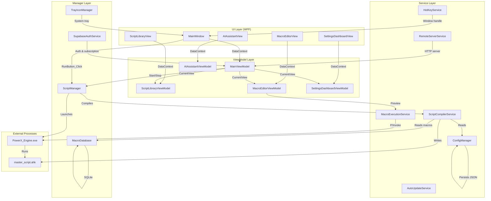
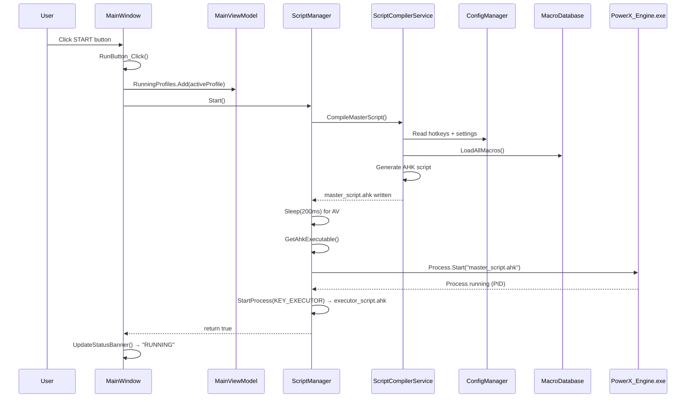
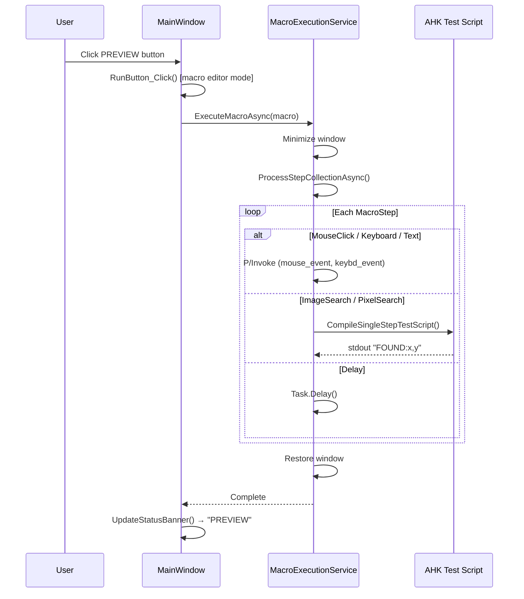
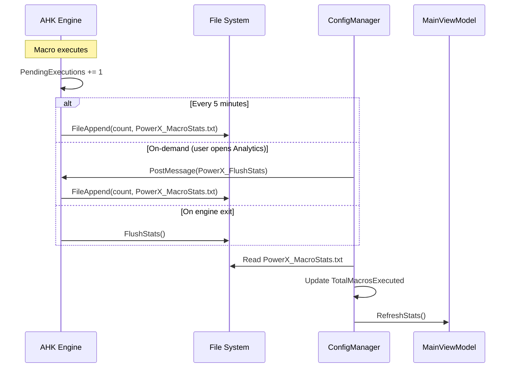
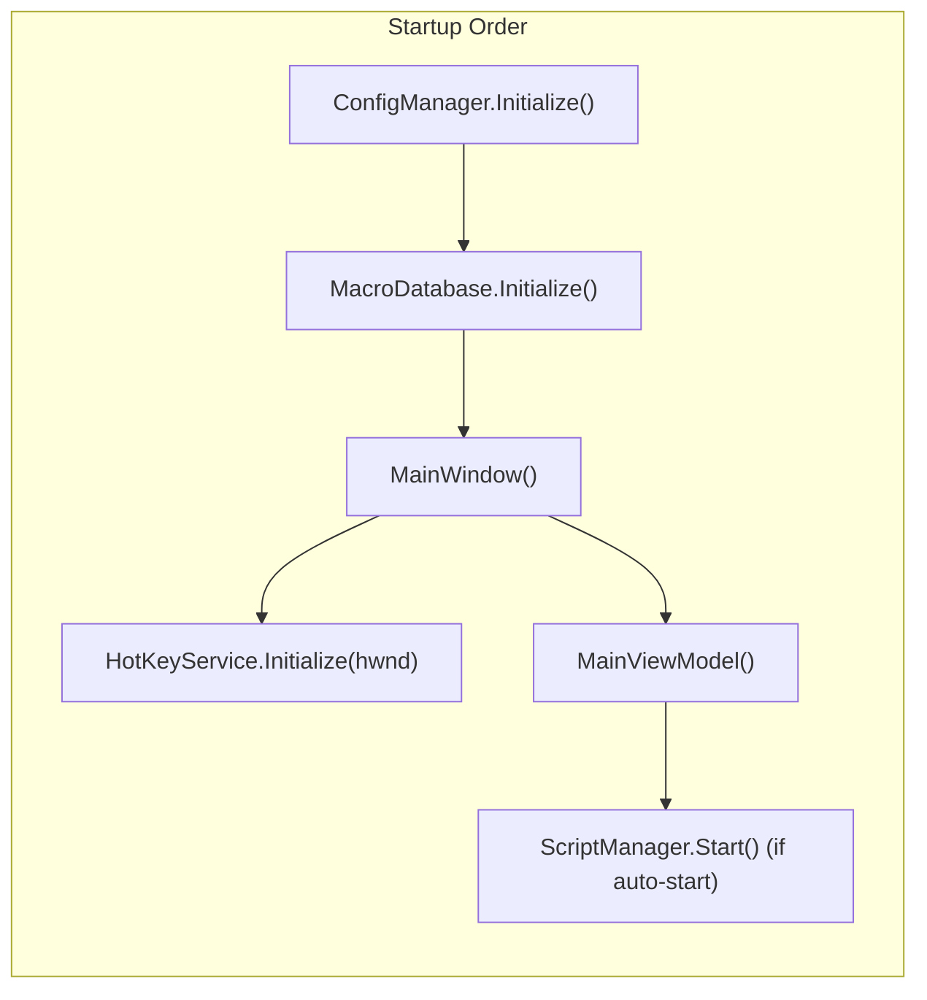

---
tags:
  - architecture
  - components
  - data-flow
  - diagram
date: 2026-05-23
last_updated: 2026-08-01
sources:
  - PowerX_Keys_V2/MainWindow.xaml.cs
  - PowerX.UI/ViewModels/MainViewModel.cs
  - PowerX.Services/Managers/ScriptManager.cs
  - PowerX.Services/Services/ScriptCompilerService.cs
status: complete
---

# Component Relationships

This page maps how the major components of PowerX Keys connect, interact, and flow data between each other.

## System Architecture Diagram



## MainWindow → ViewModel Connection

[MainWindow](file:///c:/Users/Maaz/Documents/PowerX%20Keys/PowerX_Keys_V2_Rebuild/PowerX_Keys_V2/MainWindow.xaml.cs) is the **shell** — it creates and owns the `MainViewModel`:

```csharp
// MainWindow constructor (line 105-110)
var vm = new ViewModels.MainViewModel();
this.DataContext = vm;
```

Key responsibilities of MainWindow:
- **Run/Stop button** — `RunButton_Click()` delegates to `ScriptManager.Start()`/`Stop()` or `MacroExecutionService.ExecuteMacroAsync()` depending on context
- **Status banner** — `UpdateStatusBanner()` reflects engine state (START/RUNNING/PREVIEW)
- **HotKey registration** — `OnSourceInitialized()` initializes `HotKeyService` with the window handle
- **Window restore** — Listens for `WM_RESTORE_WINDOW` broadcast message via `HwndMessageHook`
- **Engine exit handler** — Subscribes to `ScriptManager.EngineExited` to update UI
- **Drag-drop profiles** — Handles sidebar drag-and-drop for moving macros between profiles

## MainViewModel — The Central Hub

[MainViewModel](file:///c:/Users/Maaz/Documents/PowerX%20Keys/PowerX_Keys_V2_Rebuild/PowerX.UI/ViewModels/MainViewModel.cs) is the **application coordinator**. It's a singleton (`Instance` property) that manages:

### Navigation
```
CurrentView property → swaps between:
├── ScriptLibraryViewModel (default home)
├── MacroEditorViewModel (macro builder)
├── SettingsDashboardViewModel (settings)
└── SettingsViewModel (legacy)
```

Navigation has **safety guards** — if the Macro Editor has unsaved changes (`IsDirty`), navigation is blocked and an unsaved warning is triggered.

### Profile Management
- `ActiveProfile` — Currently selected profile (default: "CustomActions")
- `RunningProfiles` — `ObservableCollection<string>` of profiles currently executing
- `Profiles` — All available profiles from `ConfigManager`
- Profile changes trigger `ScriptLibraryViewModel.RefreshLibrary()` and macro re-binding

### Engine State
- `IsEngineRunning` — Two-way sync with `ScriptManager.IsRunning`
- Setting to `true` → minimizes window → calls `ScriptManager.Start()` on background thread
- Setting to `false` → calls `ScriptManager.Stop()`, clears running profiles
- Listens to `ScriptManager.EngineExited` event for unexpected exits

### Auto-Start Logic
On construction, if `AutoStartEngineOnLaunch` is enabled:
1. Restores previously active profiles from saved state
2. Delays 3.5 seconds (for stable Windows boot)
3. Calls `ScriptManager.Start()`

## Data Flow Diagrams

### Starting the Engine



### Previewing a Macro



### Stats Flow (AHK → C#)



## Service Dependencies



### ConfigManager — The Config Hub

Everything reads from `ConfigManager.Current`:
- `ScriptCompilerService` reads hotkeys/settings to generate scripts
- `ScriptLibraryViewModel` reads hotkeys to display action cards
- `MacroEditorViewModel` reads/writes individual macro bindings
- `SettingsDashboardViewModel` reads/writes all settings
- `MainViewModel` reads profiles, engine settings, last active profile

### MacroDatabase — The Macro Store

- **Write path**: `MacroEditorViewModel` → `MacroDatabase.SaveMacroAsync()`
- **Read path**: `ScriptCompilerService` → `MacroDatabase.LoadAllMacros()` (during compilation)
- **Read path**: `MainViewModel` → `MacroDatabase.LoadAllMacrosAsync()` (on startup)
- **Delete path**: `MainViewModel.DeleteMacroCommand` → `MacroDatabase.DeleteMacroAsync()`

## Component Summary Table

| Component | Type | Role | Key Connections |
|---|---|---|---|
| `MainWindow` | View | Shell, routing, status | → `MainViewModel`, `ScriptManager`, `HotKeyService` |
| `MainViewModel` | ViewModel | Navigation, profiles, engine | → `ScriptManager`, `ConfigManager`, all child VMs |
| `ScriptLibraryViewModel` | ViewModel | Dashboard cards | → `ConfigManager`, `MacroDatabase` |
| `MacroEditorViewModel` | ViewModel | Macro building | → `MacroDatabase`, `MacroExecutionService` |
| `ScriptCompilerService` | Service | AHK code generation | → `ConfigManager`, `MacroDatabase` |
| `MacroExecutionService` | Service | C# macro execution | → Win32 API, `ScriptCompilerService` (for search) |
| `ScriptManager` | Manager | AHK process lifecycle | → `ScriptCompilerService`, `PowerX_Engine.exe` |
| `ConfigManager` | Service | JSON persistence | → File system |
| `MacroDatabase` | Manager | SQLite storage | → File system |
| `HotKeyService` | Service | Global hotkeys | → `MainWindow` (HWND) |
| `TrayIconManager` | Service | System tray | → `MainWindow` |
| `SupabaseAuthService` | Service | Auth (OTP/Google), subscription checks | → `AuthWindow`, `MainViewModel`, `SettingsDashboardViewModel` |
| `RemoteServerService` | Service | Mobile HTTP server | → `ConfigManager`, `ScriptManager` |

## Key Files

- [MainWindow.xaml.cs](file:///c:/Users/Maaz/Documents/PowerX%20Keys/PowerX_Keys_V2_Rebuild/PowerX_Keys_V2/MainWindow.xaml.cs) — Shell window code-behind
- [MainViewModel.cs](file:///c:/Users/Maaz/Documents/PowerX%20Keys/PowerX_Keys_V2_Rebuild/PowerX.UI/ViewModels/MainViewModel.cs) — Central application ViewModel
- [ScriptManager.cs](file:///c:/Users/Maaz/Documents/PowerX%20Keys/PowerX_Keys_V2_Rebuild/PowerX.Services/Managers/ScriptManager.cs) — Engine process manager
- [ConfigManager.cs](file:///c:/Users/Maaz/Documents/PowerX%20Keys/PowerX_Keys_V2_Rebuild/PowerX.Services/Services/ConfigManager.cs) — Configuration hub
- [MacroDatabase.cs](file:///c:/Users/Maaz/Documents/PowerX%20Keys/PowerX_Keys_V2_Rebuild/PowerX.Services/Managers/MacroDatabase.cs) — SQLite macro storage
- [SupabaseAuthService.cs](file:///c:/Users/Maaz/Documents/PowerX%20Keys/PowerX_Keys_V2_Rebuild/PowerX.Services/Services/SupabaseAuthService.cs) — Auth & subscription service

## Related Pages

- [[overview]] — Full architecture overview
- [[execution-pipeline]] — Detailed AHK compilation pipeline
- [[dual-execution-model]] — AHK vs C# execution comparison
