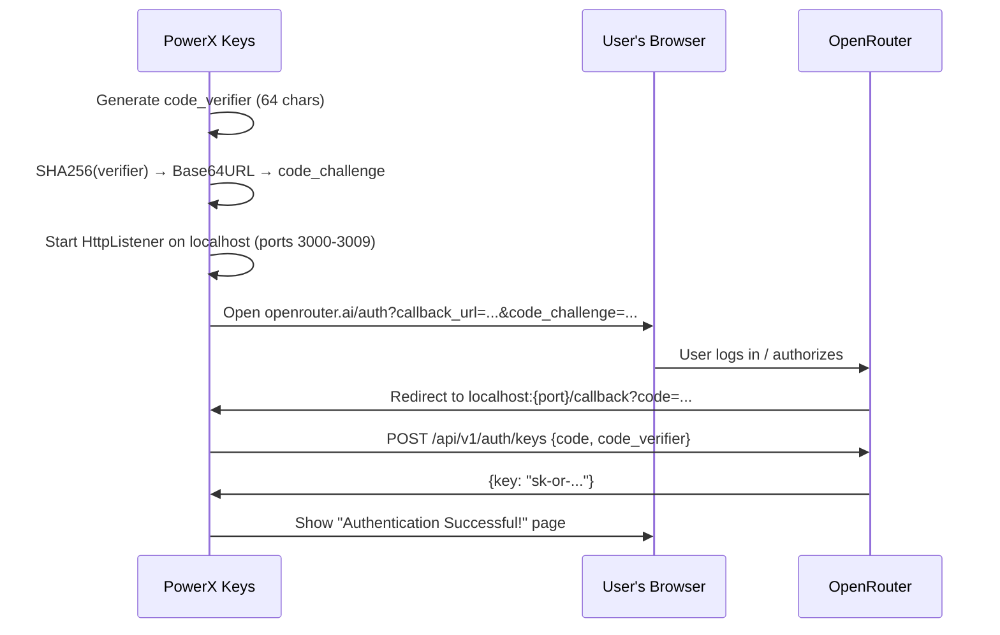

> ⚠️ **Removed / Historical** — `AILoginManager` has been **deleted** from the codebase. AI authentication is now handled natively by **`SupabaseAuthService`** (`PowerX.Services/Services/SupabaseAuthService.cs`). The section below is kept for historical context only.

# AI Login Manager 🔐 (REMOVED)

`AILoginManager` handled the **PKCE OAuth2 authentication flow** with OpenRouter to obtain an API key for the AI Assistant. It no longer exists — do not reference it in new code.

## Current Auth Path (replaces this manager)

- **App login**: `SupabaseAuthService` (`PowerX.Services/Services/SupabaseAuthService.cs`) — email OTP / magic link (`SendOtpAsync`, `VerifyOtpAsync`) or **Google OAuth** (`GetGoogleSignInUrlAsync` + local callback listener on `http://localhost:54321/`).
- **AI chat**: `AIFallbackService` (`PowerX.Services/Services/AIFallbackService.cs`) — calls a **Supabase Edge Function proxy** that holds all AI provider keys server-side. No client-side API key entry or OAuth-to-key exchange.
- Sessions are persisted to a DPAPI-encrypted file (`%LOCALAPPDATA%/PowerXKeys/cache.dat`) via `FileSessionHandler`, with offline-mode fallback.

## Historical Context (AILoginManager — deleted)

- Implemented the full Authorization Code + PKCE flow
- Opened the user's default browser for login
- Caught the callback on a local HTTP server
- Exchanged the auth code for an API key
- 5-minute timeout with cancellation support

## Historical Authentication Flow



## Historical Implementation Details

### Code Verifier
- 64 characters from `[a-zA-Z0-9-._~]`
- Generated using `RandomNumberGenerator.GetBytes()` (cryptographically secure for PKCE)

### Code Challenge
- SHA256 hash of the verifier bytes
- Base64URL encoded (replace `+` → `-`, `/` → `_`, strip `=`)
- Sent as `code_challenge_method=S256`

### Local Callback Server
- `HttpListener` on `http://localhost:{port}/` (where port is dynamically scanned from 3000-3009 to find the first free port)
- Waits for the browser redirect with `?code=` parameter
- Responds with an HTML page (green success or red failure)
- Auto-closes the browser tab after 3 seconds via JavaScript

### Token Exchange
- `POST https://openrouter.ai/api/v1/auth/keys`
- Body: `{code, code_challenge_method: "S256", code_verifier}`
- Response: `{key: "sk-or-..."}`

### Error Handling
- **Timeout**: 5-minute `Task.Delay` races against `GetContextAsync`
- **Cancellation**: `CancellationToken.Register(() => listener.Stop())` cleanly aborts
- **Missing code**: Throws descriptive exception
- **HTTP errors**: Reports status code + response body

## Historical Usage

```csharp
var manager = new AILoginManager();
try
{
    string apiKey = await manager.LoginAndGetApiKeyAsync(cancellationToken);
    // Store apiKey in config
}
catch (OperationCanceledException) { /* User cancelled */ }
catch (Exception ex) { /* Timeout or auth failure */ }
```

The returned API key was stored in the app config and used by `AIAssistantViewModel` for OpenRouter API calls.

## Key Files (current)

- [SupabaseAuthService.cs](file:///c:/Users/Maaz/Documents/PowerX%20Keys/PowerX_Keys_V2_Rebuild/PowerX.Services/Services/SupabaseAuthService.cs) — current auth implementation
- [AIFallbackService.cs](file:///c:/Users/Maaz/Documents/PowerX%20Keys/PowerX_Keys_V2_Rebuild/PowerX.Services/Services/AIFallbackService.cs) — AI chat proxy (keys server-side)

## Related Pages

- [[ai-chat]]
- [[settings-dashboard]]
- [[app-config]]
