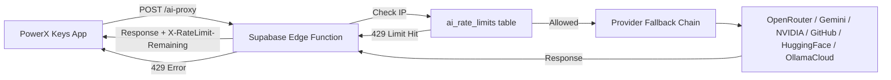
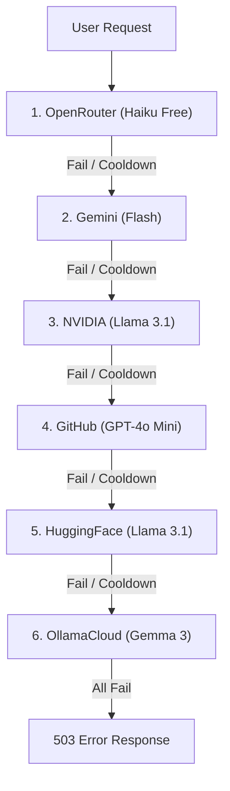

# AI Assistant

**Summary:** The AI assistant provides free, built-in macro generation and chat assistance. All API keys are stored server-side in a **Supabase Edge Function proxy** — no keys ship with the app. Rate limiting (30 requests/day per IP) is enforced server-side.

## Architecture (v5.4.0 — Server Proxy)

### Key Security Properties
- **No API keys in the app binary or config** — all keys stored as Supabase Edge Function secrets
- **No .env file shipped** — deleted from the project
- **Server-side rate limiting** — cannot be bypassed by reinstall, config edit, or clock manipulation
- **IP-based tracking** — stored in `ai_rate_limits` Supabase table

---

## Rate Limiting

| Setting | Value |
|---------|-------|
| **Daily limit** | 30 requests/day per IP |
| **Reset time** | Midnight UTC |
| **Enforcement** | Server-side (Supabase DB) |
| **Limit message** | "You've used all 30 free AI requests for today. Come back tomorrow! ⏰" |

### Planned Future Limits (after login system)

| User Type | Daily Limit |
|-----------|-------------|
| **Guest** | 3/day |
| **Free (signed up)** | 30/day |
| **Pro (paid)** | Unlimited |

---

## Provider Priority Order

The Edge Function tries providers in this order (same as before, but server-side):

---

## Supported Providers & Key Prefixes

| Provider | Key Prefix | Model | Status |
|----------|-----------|-------|--------|
| **OpenRouter** | `sk-or-` | `anthropic/claude-3-haiku:free` | ✅ Active |
| **Gemini** | `AIzaSy` / `AQ.` | `gemini-2.5-flash` | ✅ Active |
| **NVIDIA** | `nvapi-` | `meta/llama-3.1-8b-instruct` | ✅ Active |
| **GitHub** | `github_pat_` / `ghp_` | `gpt-4o-mini` | ✅ Active |
| **HuggingFace** | `hf_` | `meta-llama/Llama-3.1-8B-Instruct` | ✅ Active |
| **OllamaCloud** | 57 chars with `.` | `gemma3:4b-cloud` | ✅ Active |
| **Groq** | `gsk_` | — | ❌ Banned/Excluded |
| **Cerebras** | `csk-` | — | ❌ Banned/Excluded |

---

## Client-Side Flow (AIFallbackService.cs)

The C# service is now a thin HTTP client:

1. Build message payload (system prompt + chat history)
2. POST to `https://sgqyjylychviegbyygps.supabase.co/functions/v1/ai-proxy`
3. Include `X-PowerX-App: powerx-keys-v2` header for basic verification
4. Parse response + `X-RateLimit-Remaining` header
5. On 429 → show "daily limit reached" message

The DEV_MODE bypass is still available for local testing.

---

## Key Files
- [AIFallbackService.cs](file:///C:/Users/Maaz/Documents/New%20folder/PowerX%20Keys/PowerX_Keys_V2_Rebuild/PowerX.Services/Services/AIFallbackService.cs) — Thin proxy client (replaced the old 376-line key pool manager)
- [AIAssistantViewModel.cs](file:///C:/Users/Maaz/Documents/New%20folder/PowerX%20Keys/PowerX_Keys_V2_Rebuild/PowerX.UI/ViewModels/AIAssistantViewModel.cs) — Assistant UI logic, reads remaining count from server response

## Related Pages
- [[overview]]
- [[settings-dashboard]]
- [[ai-chat]]
