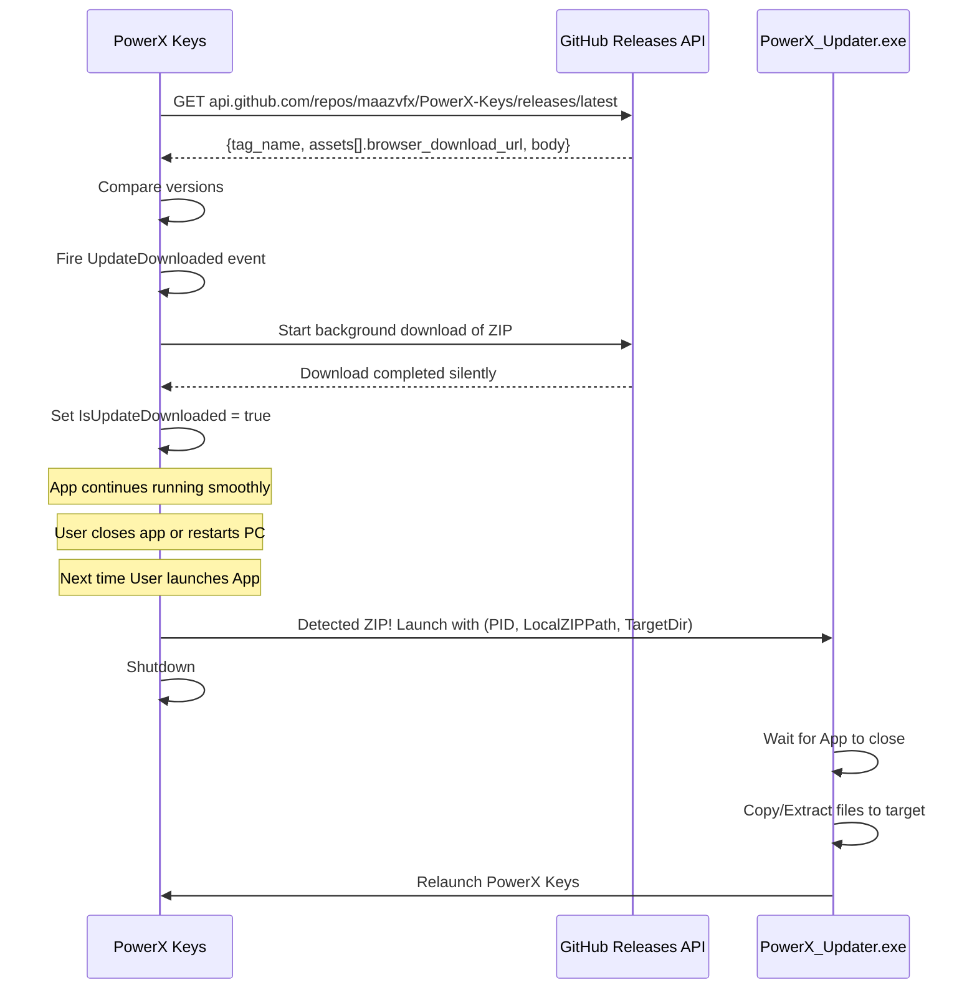

# Auto Update Service

**Summary:** Checks for application updates by querying the **GitHub Releases API** directly. When an update is available, the companion `PowerX_Updater.exe` handles the download, extraction, and hot-swap.

## Current State

| Feature | Status |
|---------|--------|
| Auto-check on startup (user-toggleable) | ✅ Working |
| Silent Background Download | ✅ Working |
| Apply on next Startup | ✅ Working |
| `AutoCheckForUpdates` setting toggle | ✅ User-editable in Settings |
| GitHub Releases API check | ✅ Direct — no proxy |

## Update Flow



## Startup Behavior

The auto-check runs on startup **only if the user has the toggle enabled**:

```csharp
// In MainWindow.xaml.cs (OnLoaded)
if (Services.ConfigManager.Current?.Settings.AutoCheckForUpdates == true)
{
    _ = PowerX_Keys_V2.Services.AutoUpdateService.CheckForUpdatesAsync();
}
```

- **Update Check** → Checks the GitHub Releases API silently on app launch when `AutoCheckForUpdates` is enabled.
- **Toggle switch** → Lives in the Settings Dashboard (bound to `AutoCheckForUpdates`, default ON) — the user can turn updates off entirely.

## Update Source (GitHub Releases API)

- Endpoint: `https://api.github.com/repos/maazvfx/PowerX-Keys/releases/latest`
- The response `tag_name` (e.g. `v5.4.0`) is compared against the local version.
- The first `.zip` asset in `assets[].browser_download_url` becomes the download link (fallback: `zipball_url`).
- The release `body` is used as the update message.

## Download & Install Flow

1. Version check succeeds → silent background download of the release ZIP (zero UI)
2. `LocalUpdateZipPath` = `%TEMP%\PowerX_Pending_Update.zip`
3. On next launch, `App.xaml.cs` detects the pending ZIP, finds `PowerX_Updater.exe` (next to main app, or in dev sibling folder), and launches it with args: `{currentPID} "{downloadURL}" "{appDirectory}"`
4. Main app shuts down; the updater waits for it to close, extracts/copies files, then relaunches PowerX Keys

## Force Update Lever (Monetization Switch)

> ⚠️ **Removed.** The earlier design had a `forceUpdate` field in a Supabase-managed manifest that could hard-block old app versions with an undismissable screen. The Supabase proxy was removed — the app now talks to the GitHub Releases API directly, and `UpdateInfo` only carries `latestVersion`, `downloadLink`, and `updateMessage`. No server-side force-update mechanism exists in the current code. (Kept here as historical reference only.)

## AutoUpdateService (C#)

| Property | Type | Description |
|----------|------|-------------|
| `CurrentAppVersion` | `Version` | Parsed from `VersionInfo.FullVersion` (currently `5.4.0`) |
| `LatestUpdate` | `UpdateInfo` | Parsed GitHub release data |
| `IsUpdateAvailable` | `bool` | True if remote > local |
| `HasCheckedForUpdates` | `bool` | True after first check |
| `IsUpdateDownloaded` | `bool` | True after silent download completes |
| `LocalUpdateZipPath` | `string` | `%TEMP%\PowerX_Pending_Update.zip` |

| Event | Description |
|-------|-------------|
| `UpdateDownloaded` | Fires after the silent background download finishes |

## PowerX_Updater.exe

Standalone console app with robust, self-healing update process:

### Self-Healing & Deletion Resilience
- **Resource Embedding**: `PowerX_Updater` binaries (`.exe`, `.dll`, `.runtimeconfig.json`, `.deps.json`) are automatically built, copied, and embedded as resources inside the main `PowerX Keys.exe` executable during compilation.
- **Auto-Restoration**: If a user deletes the updater executable, the main app automatically heals itself (`EnsureUpdaterExists` in `App.xaml.cs`):
  1. It tries to extract the updater binaries from the pending update ZIP if it exists.
  2. If that fails, it extracts them from its own embedded resources and writes them back to the disk.
  - This ensures that manual or accidental deletion of the updater files will not break future updates.

### Safety Features
- **Local file support** — `downloadUrl` can be a local path for sandbox testing
- **GUID-based temp paths** — prevents conflicts between concurrent updates
- **Cleanup** — always deletes temp ZIP and extraction directory in `finally` block
- **Recursive copy** — `CopyDirectory()` handles nested folder structures
- **Robust File Overwrite**: Retries copying locked files up to 5 times (with a 200ms delay) and safely ignores/skips locked running updater executable/DLL files to prevent update crashes when copying itself.

## Key Files

- [AutoUpdateService.cs](file:///C:/Users/Maaz/Documents/New%20folder/PowerX%20Keys/PowerX_Keys_V2_Rebuild/PowerX.Services/Services/AutoUpdateService.cs) — GitHub Releases check + silent download
- [Program.cs](file:///C:/Users/Maaz/Documents/New%20folder/PowerX%20Keys/PowerX_Keys_V2_Rebuild/PowerX_Updater/Program.cs) — robust copying logic
- [App.xaml.cs](file:///C:/Users/Maaz/Documents/New%20folder/PowerX%20Keys/PowerX_Keys_V2_Rebuild/PowerX_Keys_V2/App.xaml.cs) — `EnsureUpdaterExists` self-healing logic
- [SettingsDashboardViewModel.cs](file:///C:/Users/Maaz/Documents/New%20folder/PowerX%20Keys/PowerX_Keys_V2_Rebuild/PowerX.UI/ViewModels/SettingsDashboardViewModel.cs) — `AutoCheckForUpdates` toggle binding

## Related Pages

- [[github-setup]]
- [[config-manager]]
- [[settings-dashboard]]
