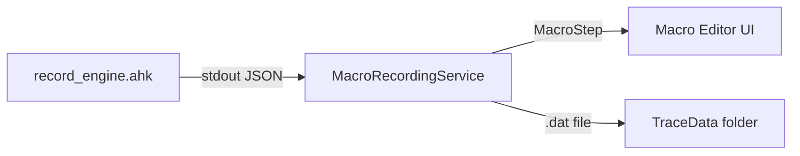

# Macro Recording Service

Records live user input (keyboard + mouse) by launching an AHK subprocess that hooks input events and streams them back to C# as JSON via stdout.

## Purpose

- Captures keyboard presses/releases with modifier key tracking
- Captures mouse clicks, drags, and scroll events
- Records mouse movement traces for [[smooth-trace-engine]] playback
- Auto-inserts delay steps between events
- Escape key stops recording

## Architecture



## Recording Flow

1. **Start** — launches `PowerX_Engine.exe` (or `AutoHotkey64.exe`) with `Scripts/record_engine.ahk`
2. **Input Hooks** — AHK script captures all keyboard/mouse events. Keyboard events use instant built-in `InputHook` (eliminating the legacy dynamic loop setup delay).
3. **JSON Stream** — each event is a JSON line on stdout:
   ```json
   {"Event":"KeyDown","Key":"a"}
   {"Event":"MouseDown","Button":"Left","X":500,"Y":300}
   {"Event":"MouseMove","X":505,"Y":302}
   {"Event":"MouseUp","Button":"Left","X":505,"Y":302}
   {"Event":"MouseScroll","Direction":"Up"}
   ```
4. **Process** — `ProcessEvent()` parses JSON and creates `MacroStep` objects
5. **Stop** — `StopRecording()` flushes traces and kills the AHK process

## Event Processing

| Event | MacroStep Type | Details |
|-------|---------------|---------|
| `KeyDown` | `Keyboard` (Hold Down) | Filters modifier auto-repeat spam |
| `KeyUp` | `Keyboard` (Released Up) | Filters orphaned KeyUps, intra-keypress delay filtering |
| `MouseDown` | `MouseClick` (Hold Down) | Starts trace recording if Left button |
| `MouseUp` | `MouseClick` (Released Up) | Flushes active trace |
| `MouseMove` | *(trace data)* | Appended to trace points if tracing active |
| `MouseScroll` | `MouseClick` (Scroll Up/Down) | Scroll amount = 1 |

## Mouse Trace Recording

When the left mouse button is held, the service records cursor positions:
- Points stored as `x,y,timeOffsetMs` lines
- Minimum movement threshold: 2px in X or Y
- Saved to `%APPDATA%\PowerX_Keys\TraceData\trace_{guid}.dat`
- Creates a `MouseTrace` MacroStep with the trace file ID

### Trace Capture Modes

| Mode | Behavior |
|------|----------|
| 0 | Disabled — no mouse movement tracking |
| 1 | During clicks only — trace while button held |
| 2 | Always — trace all mouse movement |

## Smart Delay System

- `CheckDelay()` calculates time between events using a `Stopwatch`
- Auto-inserts `MacroStepType.Delay` steps
- Micro-delay filter: delays < 50ms are discarded to reduce clutter
- Configurable via `ConfigManager.Current.Settings.AutoInsertEventDelays`

## Intra-Keypress Delay Filtering

Prevents recording artificial delays inside a single key press/release:
- **Normal**: 200ms threshold
- **Strict**: 50ms threshold
- **Relaxed**: 500ms threshold
- Configurable via `Settings.HoldDelayPreset`

## Modifier Key Handling

- Tracks `_keysDown` HashSet to match KeyDown-KeyUp pairs
- Ignores orphaned `KeyUp` events from before recording started
- Filters auto-repeat spam on modifier keys (Shift, Ctrl, Alt, Win)

## Window Move and Resize Hook

To record window move and resize actions, the service sets up a Windows event hook (`SetWinEventHook`) for `EVENT_OBJECT_LOCATIONCHANGE`.
- **UI Thread Requirement**: Windows event hooks must be registered and unregistered on the main UI thread (via the WPF dispatcher) so they can process messages through an active message loop. Setup on background thread-pool threads will fail silently without receiving events.
- **Trace Redundancy Filter**: When a window move/resize action is captured during a mouse drag, the service sets `_dragCausedWindowMove = true`. This flags the mouse up event to discard the raw drag mouse trace (`MouseTrace`) in favor of the cleaner, debounce-emitted `WindowAction` move step.

## Dispatching

Uses either sync or async dispatcher based on settings:
- `Settings.UseAsyncMacroRecording = true` → `Dispatcher.BeginInvoke()` (non-blocking)
- `Settings.UseAsyncMacroRecording = false` → `Dispatcher.Invoke()` (blocking, guaranteed order)

## AHK Engine Discovery

Searches for the AHK runtime in priority order:
1. `CoreData/PowerX_Engine.exe` (white-labeled)
2. `CoreData/AutoHotkey64.exe`
3. `PowerX_Engine.exe` in app root
4. Standard AHK v2 install paths
5. System PATH

## Key Files

- [MacroRecordingService.cs](file:///c:/Users/Maaz/Documents/PowerX%20Keys/PowerX_Keys_V2_Rebuild/PowerX_Keys_V2/Services/MacroRecordingService.cs) — 498 lines
- `Scripts/record_engine.ahk` — AHK input hook script

## Related Pages

- [[macro-execution]]
- [[smooth-trace-engine]]
- [[script-compiler]]
- [[config-manager]]

## Recent Improvements

- **Smart Filter**: Persists text bundling and shortcut/chord detection directly into stored macro steps via the IsSmartFilter setting.
- **Smart Delay Quantization**: Automatically rounds delay durations to clean, human-friendly values within BuildSmartSteps().
- **Unified Smart Mode Toggle**: Lightbulb toggle controls both IsSmartMode (timeline view) and IsSmartFilter (recording persistence) across the timeline header and settings dashboard.
- **Auto Smart Trim ✂️**: One-click median-based outlier detection that automatically caps long and abnormal delay steps.
- **Manual Trim ⚙️**: Interactive trim panel with user-defined threshold/cap inputs and live affected-step preview.
- **Wait for Window Auto-Detection**: Converts delay → window-switch patterns into WaitUntil (WindowActive) steps, displaying a 💡 hint badge when setting is OFF.
- **Launch App Auto-Detection**: Snapshots active processes at recording start and auto-inserts FileLauncher steps for newly launched applications.
- **Idle Gap Detection 💤**: Visual amber indicator badge on delay steps ≥ 5 seconds to highlight long idle pauses.