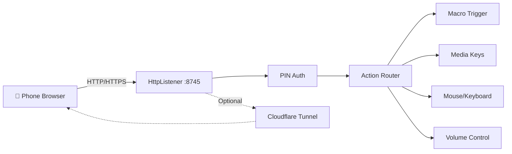

# Remote Server Service

Embedded HTTP server that enables **mobile remote control** of PowerX Keys from any phone browser on the same WiFi network — or globally via Cloudflare Tunnel.

## Purpose

- Serves a browser-based mobile control panel
- PIN-based authentication with lockout protection
- Triggers macros, media controls, mouse/keyboard simulation remotely
- Optional Cloudflare Tunnel for internet-wide remote access
- System volume control via Core Audio COM interop
- Soundboard player integration

## Architecture

## Server Configuration

| Property | Default | Description |
|----------|---------|-------------|
| `Port` | 8745 | HTTP listen port |
| `Pin` | "1234" | Authentication PIN |
| `ServerUrl` | `http://{localIP}:{port}/` | Local access URL |
| `ActiveUrl` | tunnel or local | Auto-selects tunnel URL if active |

## Security

- **PIN Authentication** — `POST /api/auth` parses the JSON body to extract the `pin` field and performs an exact string comparison (preventing weak substring authentication bypass).
- **Lockout** — tracks `_failedAttempts`, locks out after repeated failures
- **Lockout response** — returns `429` with remaining wait seconds
- **Reset** — successful PIN clears lockout state
- **Session Reset** — clearing of the `_sessionToken = null;` on Server Stop ensures clients must re-authenticate on server restart.
- **Path Traversal Prevention** — `actionId` parameters on image upload, retrieval, and delete endpoints are sanitized using `Path.GetFileName()` to prevent ZIP Slip/relative directory traversal.
- **File Type Whitelisting** — macro custom image uploads validate the extension against a strict whitelist (`.png`, `.jpg`, `.jpeg`, `.gif`, `.webp`) and reject other file types.
- **JSON Safety** — all API responses use `System.Text.Json.JsonSerializer` (no manual string interpolation)

## Connection Stability

- **Keep-alive headers** — `SendJson()` adds `Connection: keep-alive` + `Keep-Alive: timeout=30`
- **Heartbeat timeout** — JS client uses `AbortSignal.timeout(8000)` (8 seconds)
- **Heartbeat interval** — polls `/api/status` every 10 seconds
- **Enabled filter** — `/api/macros` only returns macros with `Enabled == true`
- **Execute guard** — `ExecuteAction` checks `targetAction.Enabled` before running

## Cloudflare Tunnel (Remote Access)

1. **Auto-download** — downloads `cloudflared.exe` to `%LOCALAPPDATA%\PowerX_Keys\` on first use
2. **Quick tunnel** — runs `cloudflared tunnel --url http://localhost:{port}`
3. **URL extraction** — parses `trycloudflare.com` URL from stderr
4. **Events** — `OnTunnelStatusChanged` fires with tunnel URL or null

## Win32 API Usage

| API | Purpose |
|-----|---------|
| `keybd_event` | Media keys (play/pause, next, prev, volume) |
| `SetCursorPos` / `GetCursorPos` | Remote mouse control |
| `mouse_event` | Remote click simulation |
| `GetDeviceCaps` | Physical screen resolution (ignores DPI scaling) |
| `PlaySound` | Stopping any running wav/SoundPlayer sounds |

## Core Audio COM Interop

Direct system volume control bypassing shell:
- `IMMDeviceEnumerator` → `IMMDevice` → `IAudioEndpointVolume`
- `SetMasterVolumeLevelScalar(float)` for precise volume control
- `GetMasterVolumeLevelScalar()` for reading current level
- **Headless Fallback** — checks HRESULT returns and handles null device pointers safely on systems without audio hardware (virtual machines/headless servers), falling back to a default volume of 50.

## Key Events

| Event | Parameters | Description |
|-------|-----------|-------------|
| `OnLog` | `string` | Server activity log |
| `OnStatusChanged` | `bool` | Server start/stop |
| `OnActionTriggered` | `name, message` | Remote action fired |
| `OnTunnelStatusChanged` | `string` | Tunnel URL or null |

## Server Lifecycle

- `StartAsync()` — creates `HttpListener`, starts background listen loop
- `Stop()` — cancels CTS, kills tunnel, closes listener
- `StartTunnelAsync()` — downloads cloudflared if needed, starts tunnel process
- `StopTunnel()` — kills cloudflared process

## Request Handling

The `HandleRequest()` method routes:
- `POST /api/auth` — PIN verification
- `POST /api/trigger` — trigger macros via action ID
- `GET /api/macros` — list enabled mobile macros (filtered by `Enabled`)
- `GET /api/status` — PC status (name, macro count, runs today, playing sound ID)
- `GET /api/volume` / `POST /api/volume` — read/set system volume
- `POST /api/stop` — stop all running macros and sounds
- `/api/soundboard/*` — list, upload, play, delete sounds
- `GET /` — serves the mobile remote dashboard (embedded HTML/CSS/JS)
- `GET /control` / `/controller` — serves the integrated mouse/keyboard controller (embedded HTML/CSS/JS)

## Key Files

- [RemoteServerService.cs](file:///c:/Users/Maaz/Documents/New%20folder/PowerX%20Keys/PowerX_Keys_V2_Rebuild/PowerX_Keys_V2/Services/RemoteServerService.cs) — contains integrated mobile remote and controller HTML pages, serving them directly from memory.

## Related Pages

- [[script-compiler]]
- [[config-manager]]
- [[macro-execution]]
