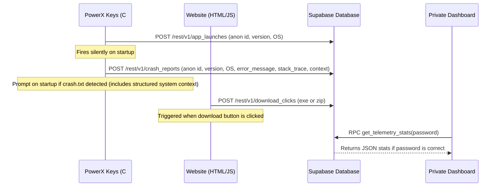

# Telemetry Service

**Summary:** Collects anonymous usage metrics to track Daily Active Users (DAU) and website download statistics without capturing any personally identifiable information (PII).

## Current State (v5.4.0)

| Feature | Status |
|---------|--------|
| App launch DAU ping | ✅ Working (Anonymous GUID) |
| Website download click tracking | ✅ Working (EXE vs ZIP) |
| In-app crash reporting | ✅ Working (Supabase REST API) |
| Supabase database integration | ✅ Configured and connected |
| Password-protected stats endpoint | ✅ Implemented via Postgres RPC |
| Private live dashboard | ✅ Created at `/private.html` |

## Telemetry Flow



## Database Schema

Four tables are defined in Supabase:

### `app_launches`
- `id` (BIGINT, Primary Key)
- `anonymous_id` (TEXT, unique random GUID saved in `telemetry_id.txt` on first launch)
- `app_version` (TEXT)
- `os_version` (TEXT)
- `created_at` (TIMESTAMPTZ, defaults to `now()`)

### `crash_reports`
- `id` (BIGINT, Primary Key)
- `anonymous_id` (TEXT, unique random GUID)
- `app_version` (TEXT)
- `os_version` (TEXT)
- `error_message` (TEXT, contains structured system context like .NET version, architecture, uptime, active profile, and hotkey count)
- `stack_trace` (TEXT, parsed from crash.txt split on `---STACKTRACE---`)
- `user_description` (TEXT, optional comment)
- `created_at` (TIMESTAMPTZ, defaults to `now()`)

### `download_clicks`
- `id` (BIGINT, Primary Key)
- `download_type` (TEXT, 'exe' or 'zip')
- `referrer` (TEXT)
- `created_at` (TIMESTAMPTZ, defaults to `now()`)

### `bug_reports`
- `id` (BIGINT, Primary Key)
- `anonymous_id` (TEXT, optional)
- `app_version` (TEXT, optional)
- `os_version` (TEXT, optional)
- `email` (TEXT, optional)
- `report_text` (TEXT, required)
- `category` (TEXT, optional - 'Bug Report', 'Feature Request', 'General Feedback', 'Question', 'Other')
- `created_at` (TIMESTAMPTZ, defaults to `now()`)

> [!IMPORTANT]
> **Row Level Security (RLS)** is enabled on all tables. Anonymous insert is allowed, but anonymous read (SELECT) is completely blocked.

---

## ⚡ Edge Functions

Supabase Edge Functions are used for processing incoming public requests securely:

### `submit-bug-report`
- **Purpose:** Verifies Cloudflare Turnstile token on the server-side, then inserts the validated bug report into the `bug_reports` database table.
- **Entrypoint:** `submit-bug-report/index.ts`
- **Authentication:** Public endpoint (`verify_jwt: false`) secured via Cloudflare Turnstile validation.

---

## Secure RPC Stats Endpoint

To query the stats securely without exposing database secret keys on client side, a PostgreSQL stored procedure `get_telemetry_stats` is implemented inside Supabase:

```sql
CREATE OR REPLACE FUNCTION get_telemetry_stats(admin_password text)
RETURNS json
SECURITY DEFINER
AS $$
DECLARE
  correct_password text := 'Maaz@86555';
  result json;
BEGIN
  IF admin_password != correct_password THEN
    RAISE EXCEPTION 'Invalid password';
  END IF;

  SELECT json_build_object(
    'total_launches', (SELECT count(*) FROM app_launches),
    'unique_users', (SELECT count(DISTINCT anonymous_id) FROM app_launches),
    'total_downloads', (SELECT count(*) FROM download_clicks),
    'exe_downloads', (SELECT count(*) FROM download_clicks WHERE download_type = 'exe'),
    'zip_downloads', (SELECT count(*) FROM download_clicks WHERE download_type = 'zip')
  ) INTO result;

  RETURN result;
END;
$$ LANGUAGE plpgsql;
```

---

## Key Files

- [TelemetryService.cs](file:///C:/Users/Maaz/Documents/New%20folder/PowerX%20Keys/PowerX_Keys_V2_Rebuild/PowerX.Services/Services/TelemetryService.cs) — Handles random GUID generation and HTTP POST requests to Supabase rest client.
- [App.xaml.cs](file:///C:/Users/Maaz/Documents/New%20folder/PowerX%20Keys/PowerX_Keys_V2_Rebuild/PowerX_Keys_V2/App.xaml.cs) — Invokes `TelemetryService.SendLaunchPingAsync()` on app startup.
- [index.html](file:///C:/Users/Maaz/Desktop/PowerXKeys-Site/PowerXKeys-Site-main/PowerXKeys_Website/index.html) — Website landing page tracking click events.
- [private.html](file:///C:/Users/Maaz/Desktop/PowerXKeys-Site/PowerXKeys-Site-main/PowerXKeys_Website/private.html) — Secure analytics page requiring password verification.

## Related Pages

- [[overview]]
- [[auto-update]]
