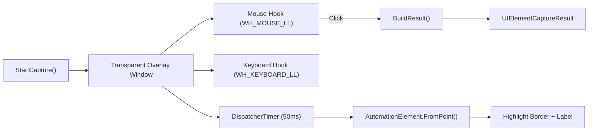

# UI Element Capture Service

Full-screen transparent overlay that lets users **visually select UI elements** using Windows UIAutomation. The selected element's properties (AutomationId, Name, ClassName, ControlType) are captured for use in macro `UIElement` steps.

## Purpose

- Provides a visual element picker for the macro editor
- Hover-to-highlight with real-time element info labels
- Single-click capture with Ctrl-to-freeze functionality
- Overlay is invisible to UIAutomation (click-through via `WS_EX_TRANSPARENT`)

## Architecture



## Overlay Design

The overlay window:
- `WindowStyle.None` + `AllowsTransparency = true` + `Background = Transparent`
- Covers entire virtual screen (`VirtualScreenLeft/Top/Width/Height`)
- `Topmost = true`, hidden from taskbar
- Extended styles: `WS_EX_TRANSPARENT | WS_EX_TOOLWINDOW` — click-through and hidden from Alt-Tab

Contains a Canvas with:
- **Border** — teal (RGB 6, 182, 212) rectangle around hovered element
- **Label** — floating text block showing `🎯 {ControlType}: {Name}`

## Interaction Flow

1. **Hover** — `Timer_Tick` runs every 50ms, calls `AutomationElement.FromPoint()`
2. **Highlight** — positions border/label over the element's `BoundingRectangle`
3. **Ctrl Hold** — freezes the current element (border turns green, label shows ✅ LOCKED)
4. **Ctrl Release** — unfreezes, returns to normal tracking
5. **Left Click** — captures the element, invokes callback, closes overlay
6. **Right Click / Escape** — cancels, invokes callback with `null`

## Element Picking & Tree Navigation (2026-08-02)

> ⚠️ **For future agents debugging UI element capture:** everything below was added/CHANGED in the 2026-08-02 overhaul. If capture behavior regresses (wrong highlight, nothing highlightable in games, weird freeze behavior), this is the first place to look.

### Element filtering — what gets highlighted (Phase 1)

`GetMeaningfulElementAtPoint()` → `FindDeepestChildAtPoint()` now only accepts **meaningful controls**, decided by `IsMeaningfulControl()`:

- **Always meaningful:** Button, Edit, Text, ListItem, ComboBox, CheckBox, RadioButton, MenuItem, TabItem, Hyperlink, List, Tree, DataGrid, Image, Slider, Spinner, ProgressBar
- **Containers (Pane / Group / Custom):** meaningful only if they have a `Name` OR `AutomationId`; nameless layout panes (WPF Grid/StackPanel, browser divs, group boxes) are **skipped** unless they contain a meaningful control deeper in the tree

**Old behavior (before 2026-08-02):** the deepest child at the point was highlighted even if it was a nameless empty pane — causing oversized/whole-window-looking highlights on empty areas.

**New behavior:** the recursion `FindDeepestChildAtPoint()` returns `null` when only nameless panes are under the cursor. The search is still depth-first; a meaningful descendant beats its own container.

### Whole-window fallback (Phase 1)

When no meaningful child is found under a large container, the fallback **returned `null`** before (treating it as empty desktop). **Now:** if the container is a `ControlType.Window`, the **window itself is returned** — so games (DirectX/Vulkan), Electron/CEF canvases, and owner-drawn apps can be captured at window level (the whole window gets highlighted and captured).

- Desktop shell (Progman/WorkerW/`#32769`) is still filtered out — desktop background stays unhighlighted.
- Mid-size named panes are returned directly (unchanged).

### Tree navigation (Phase 2)

| Input | Action |
|-------|--------|
| **Up arrow** | Step to parent of the current/frozen element |
| **Down arrow** | Step to first child (prefers a child under the cursor) |
| **Ctrl+Wheel up** | Step deeper (child) while frozen |
| **Ctrl+Wheel down** | Step up (parent) while frozen |

Behavior details:

- Navigation is **edge-triggered** (key auto-repeat is ignored) via `GetAsyncKeyState(VK_UP/VK_DOWN)` in `Timer_Tick`; Ctrl+wheel is queued by `MouseHookCallback` (`WM_MOUSEWHEEL` + `MSLLHOOKSTRUCT.mouseData` at offset 8), and only intercepted while Ctrl is held (wheel is blocked from the app underneath).
- After navigating without Ctrl, the highlight **locks** to the navigated element until the cursor moves >4px (nav-lock state, `_navLocked` + `_navStartPoint`), so the user can click to capture it.
- While Ctrl-frozen, Up/Down and Ctrl+wheel walk the tree from the frozen element; releasing Ctrl behaves as before (unfreeze) unless a nav-lock is active.
- The label shows tree depth in nav mode: `🔒 LOCKED (Tree, level N)`, where the top-level window = level 0 (`GetTreeDepth()`).
- Highlight rendering is centralized in `PositionHighlight(element, frozen, treeNav)` — teal normal, green locked.

### New/changed methods

| Method | Status | Purpose |
|--------|--------|---------|
| `IsMeaningfulControl(el)` | **NEW** | Decides if an element is a real capturable control |
| `ApplyNavigation(el, dir, pt)` | **NEW** | Parent (dir<0) / first-child (dir>0) stepping |
| `GetFirstChildAtPoint(el, pt)` | **NEW** | First valid child, prefers one under cursor |
| `GetTreeDepth(el)` | **NEW** | Tree level for the label (window = 0) |
| `PositionHighlight(el, frozen, treeNav)` | **NEW** | Central border+label rendering (replaces inline code in `Timer_Tick`) |
| `FindDeepestChildAtPoint` | **CHANGED** | Returns only meaningful elements; `null` when none |
| `GetMeaningfulElementAtPoint` | **CHANGED** | Falls back to the Window element when no meaningful child |
| `Timer_Tick` | **CHANGED** | Added arrow-key edge detection, nav-lock state, Ctrl+wheel handling |
| `MouseHookCallback` | **CHANGED** | Intercepts Ctrl+wheel for tree stepping |
| `KeyboardHookCallback` | unchanged | Still Escape-only |

**Regression watch:** if hover highlights nothing on normal apps, or highlights huge areas, check the meaningful-control type list above. If capture on games returns the window but coordinates look wrong, check the window-rect fallback path.

## Self-Exclusion

The service skips elements belonging to its own process:
```csharp
int elementPid = element.Current.ProcessId;
int myPid = Process.GetCurrentProcess().Id;
if (elementPid == myPid) return;
```

## Capture Result

`UIElementCaptureResult` contains:

| Property | Description |
|----------|-------------|
| `ElementName` | `AutomationElement.Current.Name` |
| `AutomationId` | Unique ID if available |
| `ClassName` | Win32 class name |
| `ControlType` | Button, Edit, Text, Window, etc. |
| `WindowTitle` | Parent window name (walks up tree) |
| `X`, `Y` | Center of element's bounding rectangle |
| `ScreenshotPath` | File path to captured element screenshot (PNG) |

## Window Title Discovery

Walks up the UI tree using `TreeWalker.ControlViewWalker` to find the nearest parent `Window` control type.

## Win32 Hooks

| Hook | Constant | Purpose |
|------|----------|---------|
| Mouse | `WH_MOUSE_LL` (14) | Intercepts left/right clicks + Ctrl+wheel (tree navigation) |
| Keyboard | `WH_KEYBOARD_LL` (13) | Intercepts Escape key |

Both hooks return `(IntPtr)1` to **block** the event from reaching other apps (prevents accidental clicks during capture).

## Additional Win32 APIs

| API | Purpose |
|-----|---------|
| `GetCursorPos` | Gets current mouse coordinates |
| `WindowFromPoint` | Native window detection |
| `GetWindowLong` / `SetWindowLong` | Modify overlay extended styles |
| `GetAsyncKeyState` | Check if Ctrl is held |

## Key Methods

| Method | Description |
|--------|-------------|
| `StartCapture(callback)` | Creates overlay, installs hooks, starts timer (runs on WPF Dispatcher thread for STA safety) |
| `StopCapture()` | Unhooks, closes overlay, cleans up (runs on WPF Dispatcher thread) |
| `Timer_Tick()` | 50ms polling — highlight + capture + tree navigation (arrow keys / Ctrl+wheel) |
| `BuildResult(element)` | Extracts all properties from an AutomationElement |
| `IsMeaningfulControl(el)` | Filters empty layout panes from hover targets (added 2026-08-02) |
| `PositionHighlight(el, frozen, treeNav)` | Central border+label rendering (added 2026-08-02) |
| `MouseHookCallback()` | Left-click capture, right-click cancel, Ctrl+wheel tree stepping |
| `KeyboardHookCallback()` | Handles Escape to cancel |

## Threading & Cleanup Safety

- **Dispatcher Thread Safety:** Both `StartCapture()` and `StopCapture()` marshal execution to the main WPF Dispatcher thread using `Application.Current.Dispatcher.Invoke(...)` if called from a non-UI thread, preventing STA thread exceptions during overlay window creation.
- **Robust Hook Clean-up:** To prevent mouse and keyboard interception from lingering on error, click handling inside `Timer_Tick` wraps `BuildResult()` in a try-catch and cleans up the hooks in a `finally` block, ensuring `StopCapture()` executes and uninstalls Win32 hooks in all circumstances.

## Screenshot Capture

During element capture, a screenshot of the element's bounding rectangle (with 8px padding) is automatically saved:
- **Capture:** `BuildResult()` uses `System.Drawing.Graphics.CopyFromScreen()` on the element's `BoundingRectangle`
- **Temp storage:** `%LOCALAPPDATA%\PowerXKeys\Engine\TempImages\UICapture_*.png`
- **Permanent storage:** Moved to `%LOCALAPPDATA%\PowerXKeys\Engine\Images\` on macro save
- **Display:** 40px thumbnail in block card with 300px hover-to-zoom tooltip
- **Auto-update:** Test button refreshes screenshot when element is found
- **Converter:** Reuses existing `ImagePathToThumbnailConverter` from Image Search blocks

## Search Behavior (Execution)

When a UIElement step runs (both AHK compiler and C# preview executor), the search uses an AND-condition built from these properties:

| Property | UIA Property ID | Used in Search |
|----------|----------------|----------------|
| `AutomationId` | 30011 | ✅ If non-empty |
| `ElementName` | 30005 | ✅ If non-empty |
| `ClassName` | 30012 | ✅ If non-empty |
| `ControlType` | 30003 | ✅ If non-empty (mapped to UIA integer ID) |

**UIFindMode** determines search strategy: `"Exact"` uses `FindFirst`, `"Find Latest"` uses `FindAll` and picks the last match.

## Offset Support

Users can specify a coordinates offset (X, Y) relative to the center of the UI element's bounding rectangle:
- **Checkbox:** Activated by checking "Use Target Offset" in the UI Element Match Settings popup.
- **Overlay:** Launches the standard `OffsetCaptureWindow` passing the element's cached center coordinates as the anchor point, providing a visual connecting line effect.
- **Compiler:** The compilation logic applies the specified `OffsetX` and `OffsetY` to the target coordinates during clicks, double clicks, right clicks, set-text fallbacks, and toggle fallbacks.
- **Invoke Pattern Bypass:** When `UseTargetOffset` is active, programmatic `InvokePattern` and `TogglePattern` calls are bypassed to force coordinate click execution at the exact offset location.

## Coordinate Fallback

When `UIFallbackToCoordinates` is enabled and the element isn't found, **only click-like actions** get meaningful fallback to saved X,Y coordinates:

| UIAction | Coordinate Fallback |
|----------|-------------------|
| Click, Double Click, Right Click | ✅ Mouse event at saved position |
| Focus, Check Exists | ✅ Click at saved position |
| Set Text, Toggle, Select, Read Text | ❌ Reports failure (needs real element) |
| Wait Until Found, Wait Until Gone | ❌ Reports failure (needs real element) |

## Key Files

- [UIElementCaptureService.cs](file:///c:/Users/Maaz/Documents/New%20folder/PowerX%20Keys/PowerX_Keys_V2_Rebuild/PowerX_Keys_V2/Services/UIElementCaptureService.cs)
- [UIElementHighlightWindow.cs](file:///c:/Users/Maaz/Documents/New%20folder/PowerX%20Keys/PowerX_Keys_V2_Rebuild/PowerX_Keys_V2/Views/UIElementHighlightWindow.cs)
- [ScriptCompilerService.cs](file:///c:/Users/Maaz/Documents/New%20folder/PowerX%20Keys/PowerX_Keys_V2_Rebuild/PowerX_Keys_V2/Services/ScriptCompilerService.cs) — UIElement compilation (lines ~2283–2798)
- [MacroExecutionService.cs](file:///c:/Users/Maaz/Documents/New%20folder/PowerX%20Keys/PowerX_Keys_V2_Rebuild/PowerX_Keys_V2/Services/MacroExecutionService.cs) — UIElement C# preview execution (lines ~1003–1797)

## Related Pages

- [[macro-execution]]
- [[script-compiler]]
- [[macro-recording]]

